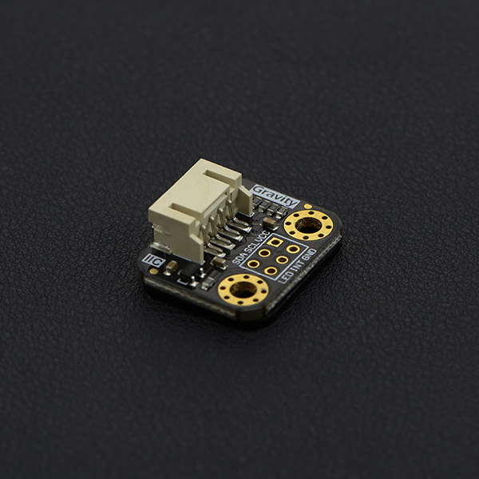

# DFRobot_TCS34725

- [English Version](./README.md)

TCS34725是一款低成本，高性价比的RGB全彩颜色识别传感器，传感器通过光学感应来识别物体的表面颜色。支持红、绿、蓝(RGB)三基色，支持明光感应，可以输出对应的具体数值，帮助您还原颜色本真。 为了提高精度，防止周边环境干扰，我们特意在传感器底部添加了一块红外遮光片，最大程度减小了入射光的红外频谱成份，让颜色管理更加准确。板载自带四个高亮LED，可以让传感器在低环境光的情况下依然能够正常使用，实现“补光”的功能。模块采用I2C通信，拥有PH2.0和XH2.54（面包板）两种接口，用户可以根据自己的需求来选择接口，更加便利。


## 产品链接(https://www.dfrobot.com.cn/goods-1349.html)

SKU：SEN0212

## 目录

* [概述](#概述)
* [库安装](#库安装)
* [方法](#方法)
* [兼容性](#兼容性y)
* [历史](#历史)
* [创作者](#创作者)

## 概述

一个颜色传感器库

## 库安装

使用此库前，请首先下载库文件，将其粘贴到\Arduino\libraries目录中，然后打开examples文件夹并在该文件夹中运行演示。

## 方法
```C++
	/**
	 * @fn begin
	 * @brief 初始化I2C并配置传感器(在做其他事情之前调用此函数)。  
	 * @return boolean
	 * @retval true success
	 * @retval false fail
	 */
	boolean begin(void);

	/**
	 * @fn setIntegrationtime
	 * @brief 设置TC34725的集成时间。
	 * @param it  积分时间
	 */
	void setIntegrationtime(eIntegrationTime_t it);

	/**
	 * @fn setGain
	 * @brief 调整TCS34725上的增益(调整对光的灵敏度)  
	 * @param gain  增益时间
	 */
	void setGain(eGain_t gain);

	/**
	 * @fn getRGBC
	 * @brief 读取原始的红、绿、蓝和清晰的通道值  
	 * @param r  red.
	 * @param g  green.
	 * @param b  blue.
	 * @param c  color temperature
	 */
	void getRGBC(uint16_t *r, uint16_t *g, uint16_t *b, uint16_t *c);

	/**
	 * @fn calculateColortemperature
	 * @brief 将原始R/G/B值转换为色温(以度为单位)  
	 * @param r  red.
	 * @param g  green.
	 * @param b  blue.
	 * @return uint16_t 色温
	 */
	uint16_t calculateColortemperature(uint16_t r, uint16_t g, uint16_t b);

	/**
	 * @fn calculateLux
	 * @brief 将原始的R/G/B值转换为lux
	 * @param r  red.
	 * @param g  green.
	 * @param b  blue.
	 * @return  uint16_t lux.
	 */
	uint16_t calculateLux(uint16_t r, uint16_t g, uint16_t b);

	/**
	 * @fn lock
	 * @brief 启用中断
	 */
	void lock(void);

	/**
	 * @fn unlock
	 * @brief 不启用中断
	 */
	void unlock(void);

	/**
	 * @fn clear
	 * @brief 清除中断
	 */
	void clear(void);

	/**
	 * @fn setIntLimits
	 * @brief 设置Int限制
	 * @param l 低  
	 * @param h 高 
	 */
	void setIntLimits(uint16_t l, uint16_t h);

	/**
	 * @fn enable
	 * @brief 使能设备
	 */
	void enable(void);

	/**
	 * @fn enable
	 * @brief 不使能设备
	 */
	void disable(void);

	/**
	 * @fn readRegword
	 * @brief 获取寄存器数据
	 * @param reg
	 * @return uint16_t
	 */
	uint16_t readRegword(uint8_t reg);

	/**
	 * @fn setGenerateinterrupts
	 * @brief 设置通用中断
	 */
	void setGenerateinterrupts(void);

```
## 兼容性

主板               | 通过  | 未通过   | 未测试   | 备注
------------------ | :----------: | :----------: | :---------: | -----
FireBeetle-ESP32  |      √       |             |            | 
FireBeetle-ESP8266|      √       |              |             | 
Mega2560  |      √       |             |            | 
Arduino uno |       √      |             |            | 
Leonardo  |      √       |              |             | 
Micro：bit  |      √       |              |             | 
M0  |      √       |              |             | 

## 历史

- 2022/3/16 - 1.0.0 版本

## 创作者

Written by PengKaixing(kaixing.peng@dfrobot.com), 2021. (Welcome to our [website](https://www.dfrobot.com/))
